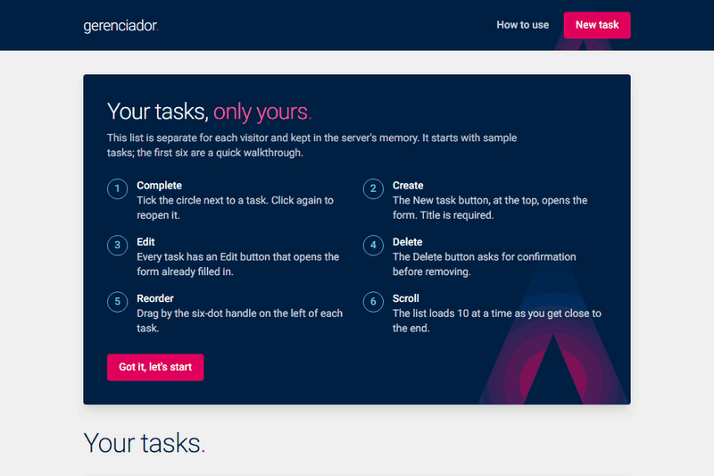

<h1 align="center">Gerenciador de tarefas</h1>

<p align="center">
  Criar, listar, editar, concluir e excluir tarefas.<br>
  Next.js 15 com tRPC, listagem renderizada no servidor e rolagem infinita.
</p>

<p align="center">
  <a href="https://gerenciador.guistreahl.com.br">
    
  </a>
</p>

<p align="center">
  <a href="https://github.com/guistreahl/artefact-case/actions/workflows/ci.yml"></a>
  <a href="https://github.com/guistreahl/artefact-case/actions/workflows/deploy.yml"></a>
</p>

<p align="center">
  
</p>

Na primeira visita, um painel explica como usar, e as seis primeiras tarefas
da lista são um roteiro para experimentar cada função. O painel volta pelo
link **Como usar**, no topo.

## Rodar localmente

Requer Node.js 22 ou mais recente.

```bash
npm install
npm run dev
```

Abre em <http://localhost:3000>. Nenhuma variável de ambiente é necessária.

Para rodar o build de produção, o mesmo servidor que vai para a imagem Docker:

```bash
npm run build
npm start
```

Ou com Docker, sem instalar Node:

```bash
docker build -t tarefas .
docker run -p 8080:8080 tarefas
```

## Testes

```bash
npm test                          # unidade (Vitest), direto no router do tRPC
npx playwright install chromium   # só na primeira vez
npm run build && npm run test:e2e # navegador (Playwright), contra o build de produção
```

## Como funciona

```
navegador ──► Next.js (App Router)
                 ├─ Server Components ── chamada direta ──┐
                 └─ /api/trpc ◄── cliente tRPC ◄── React  │
                                   │                      │
                                   ▼                      ▼
                              router tRPC ──► Map em memória, uma lista por visitante
```

1. **Listagem com SSR.** A página `/` busca a primeira página de tarefas no
   servidor e entrega o HTML pronto. O mesmo dado vai para o cache do
   TanStack Query no cliente, que continua a rolagem a partir dele.
2. **Rolagem infinita** por cursor: 10 tarefas por vez, carregadas quando o
   fim da lista se aproxima da tela.
3. **Um schema, dois lugares.** O schema Zod de `src/server/tarefas/schema.ts`
   valida o formulário no navegador e a entrada no servidor.
4. **Erros com significado.** `NOT_FOUND` para tarefa inexistente,
   `BAD_REQUEST` com a mensagem de cada campo. O formulário mostra o erro
   embaixo do campo; a lista mostra avisos de sucesso e de erro.
5. **Confirmação antes de excluir**, num diálogo acessível pelo teclado.
6. **Ordem manual.** As tarefas são arrastáveis para cima e para baixo, com
   mouse, toque ou teclado, e a ordem fica guardada no servidor.
7. **Conclusão com horário.** Marcar uma tarefa registra quando ela foi
   concluída; reabrir apaga o registro.
8. **Atualizações otimistas.** Excluir, concluir e mover mudam a tela na
   hora, e ela volta ao estado anterior, com aviso, se o servidor recusar. Os
   avisos flutuam no alto da janela, visíveis em qualquer ponto da rolagem.
9. **Uma lista por visitante.** Um cookie anônimo separa as listas, para que
   quem abre o endereço público veja só o que criou. Toda lista nova começa
   com 30 tarefas fictícias de exemplo.
10. **Identidade visual** inspirada na da Artefact: marinho, magenta,
   turquesa e Roboto, definidos como tokens em `src/app/globals.css`.

Como tudo fica em memória, a lista recomeça quando o servidor reinicia. No
Cloud Run, isso acontece depois de alguns minutos sem acesso.

A arquitetura completa, com as decisões e a infraestrutura, está em
[`docs/SDD.md`](docs/SDD.md).

## Estrutura

```
src/
  server/            backend: schema, store em memória, router tRPC
  trpc/              ligação do tRPC com o React (cliente) e com os Server Components
  app/               rotas do Next.js
  components/        lista, formulário e avisos
e2e/                 testes do Playwright
infra/               Terraform do Google Cloud
.github/workflows/   CI e deploy
```

## Deploy

Cada push na `main` que passa no CI é publicado no Cloud Run:

1. A imagem é montada e publicada no Artifact Registry.
2. Uma revisão nova sobe **sem tráfego**, numa URL própria.
3. Os testes do Playwright rodam contra essa URL.
4. Só então a revisão passa a receber 100% do tráfego.

A autenticação no Google usa Workload Identity Federation, sem chave de
service account. A infraestrutura está descrita em [`infra/`](infra/).

O domínio passa pelo Cloudflare, que desafia robôs e limita requisições por
IP. A aplicação recusa o que não passou por ele, então o endereço direto do
Cloud Run também fica protegido.
